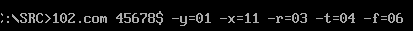
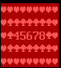

# Проект Рамка в Dosbox

Эта программа предназначена для отображения рамки с информацией в консоли Dosbox.

# Основные функции

Программа вызывается из папки `src` командной `102.com`.
Поддерживаются следующие аргументы запуска:
- `-x=`, `-y=` - задание координат левого верхнего угла рамки.
Аргументом является 16-тиричное число.
- Настройка символов рамки
    - `-f=` - настройка фона
    - `-r=` - настройка линий рамки

    Аргументом является также шестадцатиричное число.
- `text + $` - задание текста рамки. Можно задавать несколько строк.
`$` - символ новой строки. !Важно, строки будут выводиться о обратном порядке.
    Текст будет выровнен посередине.

Для всех шетнадцатиричных аргументов необходимо два символа. Если использовать 1 символ - возможно неопределенное поведение вывода.

Порядок аргументов не важен.

# Пример вызова

`` - пример кода вызова

# Результат

