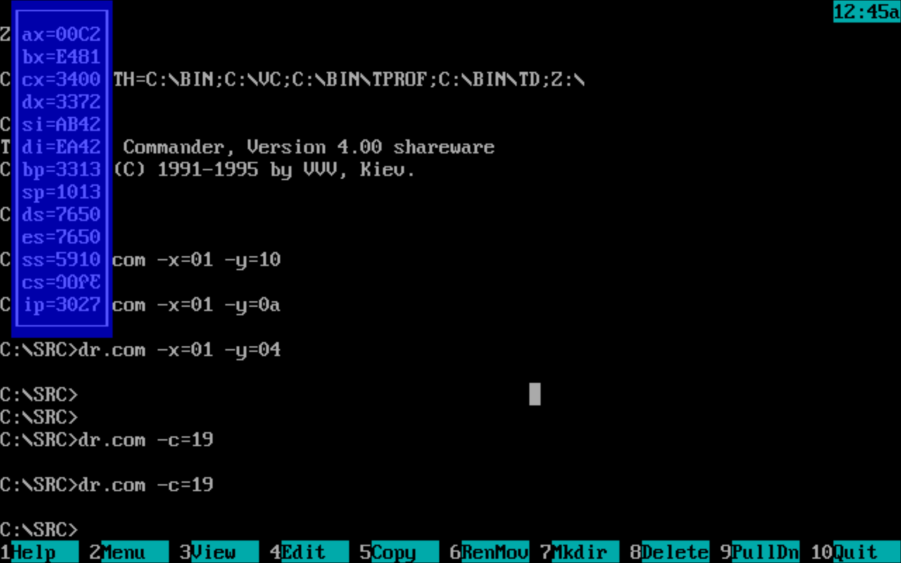

# Драйвер клавиатуры

Учебная программа по обработке и и использованию прерываний в эмуляции Dosbox.
Цель работы: Написание драйвера по обработке нажатий клавиатуры и вывода регистров программы, из которой произошло прерывание.

# Использование

Для запуска программы необходимо перейти в папку `src` и запустить `dr.com`.
Программа инициализируется и становиться резидентом(то есть останется в памяти, но не будет занимать поток обработки).

Для вывода регистров необходимо нажать на клавишу `esc`. При этом будет нарисована рамка со значениями регистров.
Повторное нажатие на клавишу приведет к сокрытию рамки.
При этом значения регистров обновляются с каждым тиком таймеры.

# Функционал

Программа поддерживает управление следующими параметрами:
- Координата по **X** и **Y**
- Общий цвет рамки и данныхп

Для использования необходимо в командной строку помимо ввода названия программы указать следующие флаги:
- `-x=` - для настройки координаты по **X**
- `-y=` - для настройки координаты по **Y**
- `-c=` - для настройки цвета рамки

После любого флага должны идти 2 символа, которые обозначают 16-число, которое и будет использовано в программе.
Например, для настройки координаты по **X** на 1 необходимо ввести:
```dr.com -x=01```
Если не набрать 0 - то следующий после нуля символ будет считан как число и в программе возникнет неопределенное поведение. Поэтому пожалуйста, указываете всегда 2 символа.

# Примеры вызова и результата

`dr.com -x=01 -y=04`


`dr.com -c=19`


# Особенности

При изменении текущего окна рамка не перерисовывается.

Ход исправлений и доработок смотрите в Патчах.

# Патчи

## 1.0
Работает основной функционал.
При использовании с Волковым возможно неопределенное поведение.

## 1.1
Исправлено неопределенное поведение при использовании с Волковым.
Цели на будущее:
- Сделать постоянную отрисовку рамки
- Добавить тройную буферизацию вывода
- Добавить возможность конфигурации рамки

## 1.2
Добавлена тройная буферизация, однако присутствуют некоторые артефакты в выводе + убрана возможность более тонкой настройки рамки.
Цели на будущее:
- Исправление артефактов рамки
- Добавление парсера аргументов командной строки

## 1.3
Исправлены ошибки в тройной буферизации, добавлены аргументы командной строки
