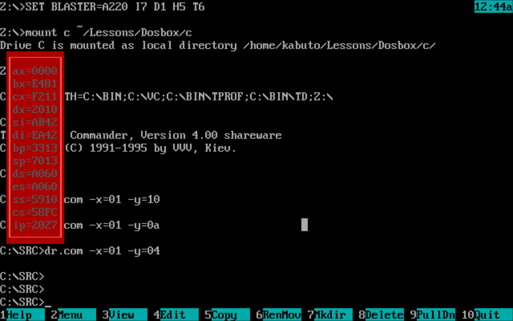

# Работа по написанию драйвера клавиатуры в виртуальной среде `DosBOX`

# 1. Цель работы
Разработка обработчика прерываний клавиатуры. Добавление собственных горячих клавиш управления событиями. Создание утилиты для постоянного отображения состояния регистров текущей программы.

# 2. Функционал программы
Разработанная утилита поддерживает следующие настройки:
- Координаты окна состояния регистров по **X** и **Y**.
- Цвет окна состояния и данных в нем.

Для их использования необходимо указать следующие аргументы командной строки:
- `-x=`, `-y=` для настройка координат.
- `-c=` для настройки цвета.

После каждого аргумента сразу за ним должно идти 16-тиричное число, отвечающее за значение аргумента при работе программы.

```
Важное дополнение! Числом считаются два символа, идущие сразу после `=`. Поэтому, если поставить пробел или написать только один символ, вы можете получить не тот результат, который ожидали.
```

# 3. Запуск и использование

Программа представляет собой файл `dr.com`, хранящийся в папке `src/Rep/`.
Для её запуска необходимо набрать соотвествующий адрес в командной строке.
Программа запустится в режиме резидента и для её завершения необходимо будет самостоятельно освободить выделенную под неё память.

За включения и выключения отображения состояния регистров отвечает клавиша `esc`.
Состояние обновляется с каждым тиком системного таймера.

# 4. Примеры использования

`dr.com -x=01 -y=04`
[](../SRC/Image/3.png)

`dr.com -c=19`
[](../SRC/Image/3.png)

# Патчи

## 1.0
Работает основной функционал.
При использовании с Волковым возможно неопределенное поведение.

## 1.1
Исправлено неопределенное поведение при использовании с Волковым.
Цели на будущее:
- Сделать постоянную отрисовку рамки
- Добавить тройную буферизацию вывода
- Добавить возможность конфигурации рамки

## 1.2
Добавлена тройная буферизация, однако присутствуют некоторые артефакты в выводе + убрана возможность более тонкой настройки рамки.
Цели на будущее:
- Исправление артефактов рамки
- Добавление парсера аргументов командной строки

## 1.3
Исправлены ошибки в тройной буферизации, добавлены аргументы командной строки
